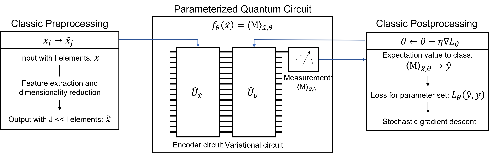
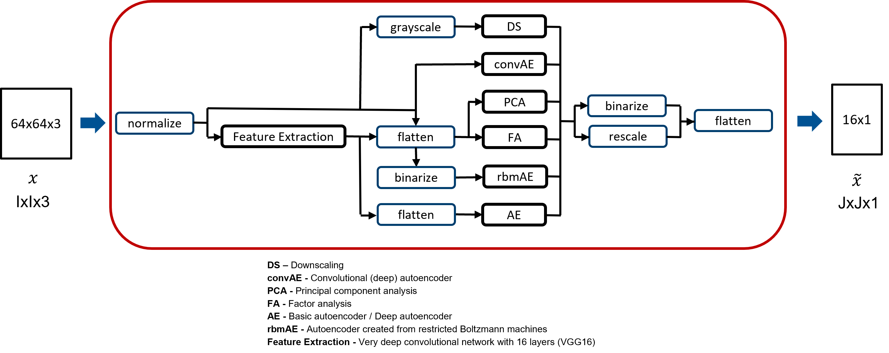

# QMLforRS

## TO DO
* Check TO-DOs im Code
* default EPOCHS anpassen
* neue rbm implementierung ohne torch?
* vgg16 ersetzten mit vgg16wft.py?

### Quantum Machine Learning for Remote Sensing
Hybrid systems for the classification of satellite imagery. Experiments were performed with EuroSAT and NWPU-RESISC45 data but can also be used for arbitrary datasets with small changes. Pre- and postprocessing are performed classical while a parameterized quantum circuit is used for classification. The hybrid systems use 16 data qubits and the quantum systems are simulated on the GPU.


*Figure 1: General scheme for hybrid systems*

Available preprocessing methods:
* VGG16 (without fully connected top layers for classification)
* Downscaling
* Principal component analysis
* Factor analysis
* Simple autoencoder
* Deep autoencoder
* Convolutional autoencoder
* Autoencoder created from restricted Boltzmann machines


*Figure 1: Preprocessing pipelines*

Available quantum encodings:
* Basis encoding
* Angle encoding

Available quantum circuit architectures:
* FPQC
* GPQC

Available loss functions:
* Hinge loss
* Square hinge loss
* Binary cross-entropy loss

Available optimizers:
* Adam

## Default Usage
Default training and evaluation of a hybrid system with EuroSAT data. By default, binary classification of the EuroSAT classes AnnualCrop and SeaLake is performed. The Dimensionality reduction is done with PCA and the compressed data is angle encoded and classified by a parameterized quantum circuit. 
```
python train.py -dp './EuroSAT/data'
```

For parameter usage check:
```
python train.py --help
```

Furthermore, one-versus-rest multiclass classification can be performed. However, the script is currently limited and only classification of the EuroSAT dataset with preprocessing by a VGG16 combined with a deep autoencoder and the FPQC for classification can be performed. 
For multiclass classification execute:
```
python train_ovr.py -dp './EuroSAT/data'
```

## Acknowledgements
Quellenangabe für e.g. DAE/RBM
...
* FPQC [Farhi et al., 2018](https://arxiv.org/abs/1802.06002)
* GPQC [Grant et al., 2018](https://arxiv.org/abs/1804.03680)
* VGG16 [Simonyan et al., 2014](https://arxiv.org/abs/1409.1556v5)
* EuroSAT [Helber et al., 2019](https://arxiv.org/abs/1709.00029)
* NWPU-RESISC45 [Cheng et al., 2017](https://arxiv.org/abs/1703.00121)

## TBD
* Add additional optimization methods.
* Add more preprocessing methods.
* Add more circuit architectures.
* Add probability calibrated classifiers
