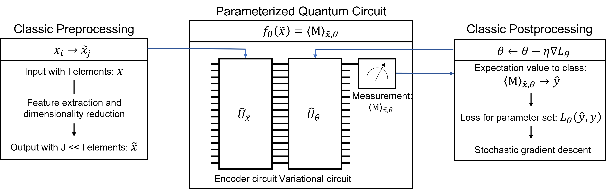
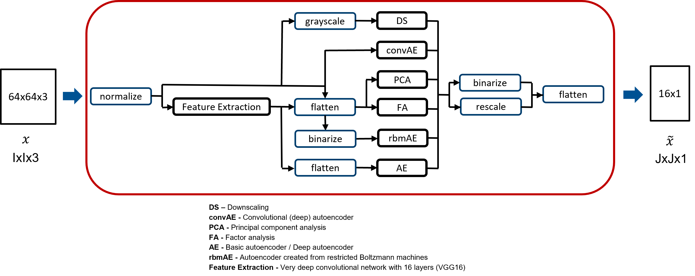

# QC4RS
## Quantum Classifiers for Remote Sensing


*Figure 1: General scheme for hybrid systems*

Framework for hybrid systems for the classification of satellite imagery. Pre- and postprocessing are performed classical while a parameterized quantum circuit is used for classification. The hybrid systems use 16 data qubits and the quantum systems are simulated on the GPU. Classifications were performed with EuroSAT and NWPU-RESISC45 data.


*Figure 2: Preprocessing pipelines*

Available preprocessing methods:
* VGG16 (without fully connected top layers for classification)
* Downscaling
* Principal component analysis
* Factor analysis
* Simple autoencoder
* Deep autoencoder
* Convolutional autoencoder
* Autoencoder created from restricted Boltzmann machines

Available quantum encodings:
* Basis encoding
* Angle encoding

Available quantum circuit architectures:
* FPQC
* GPQC

Available loss functions:
* Hinge loss
* Square hinge loss
* Binary cross-entropy loss

Available optimizers:
* Adam

## Setup
Create a directory:
```bash
mkdir qc4rs_dir && cd qc4rs_dir
```
Clone the repository:
```bash
git clone https://github.com/tumbgd/qc4rs.git
```
Download and unzip a dataset, e.g. EuroSAT:
```bash
curl https://madm.dfki.de/files/sentinel/EuroSAT.zip -o EuroSAT.zip && unzip EuroSAT.zip
```
Build the container (The version in the keyring URL inside the Dockerfile is important, note this example is for Debian 10. You can find your version with the command 'lsb_release -a' in a workspace terminal):
```bash
cd qc4rs && docker build -t qc4rs .
```
Start the container:
```bash
docker run -it --rm -v /path/to/qc4rs_dir:/tf --gpus=all --name=qc4rs_container qc4rs
```

## Default usage
Default training and evaluation of a hybrid system with EuroSAT data. By default, binary classification of the EuroSAT classes AnnualCrop and SeaLake is performed. The Dimensionality reduction is performed with a VGG16 combined with a deep autoencoder and the compressed data is angle encoded and classified by a parameterized quantum circuit with the FVQC as training layer.
```bash
python train.py
```
The training layer and all other parts can be easily adapted by several parameters. For a description of the parameter usage check:
```bash
python train.py --help
```
One-versus-rest multiclass classification can be performed. However, the script is limited since only classification of the EuroSAT dataset with preprocessing by a VGG16 combined with a deep autoencoder and the FPQC for classification can be performed with sufficent accuracy.
For multiclass classification execute:
```bash
python train_ovr.py
```

## Acknowledgements
* FPQC [Farhi et al., 2018](https://arxiv.org/abs/1802.06002)
* GPQC [Grant et al., 2018](https://arxiv.org/abs/1804.03680)
* VGG16 [Simonyan et al., 2014](https://arxiv.org/abs/1409.1556v5)
* EuroSAT [Helber et al., 2019](https://arxiv.org/abs/1709.00029)
* NWPU-RESISC45 [Cheng et al., 2017](https://arxiv.org/abs/1703.00121)
* Original RBM implementation [eugenet12, 2020](https://github.com/eugenet12/pytorch-rbm-autoencoder)
